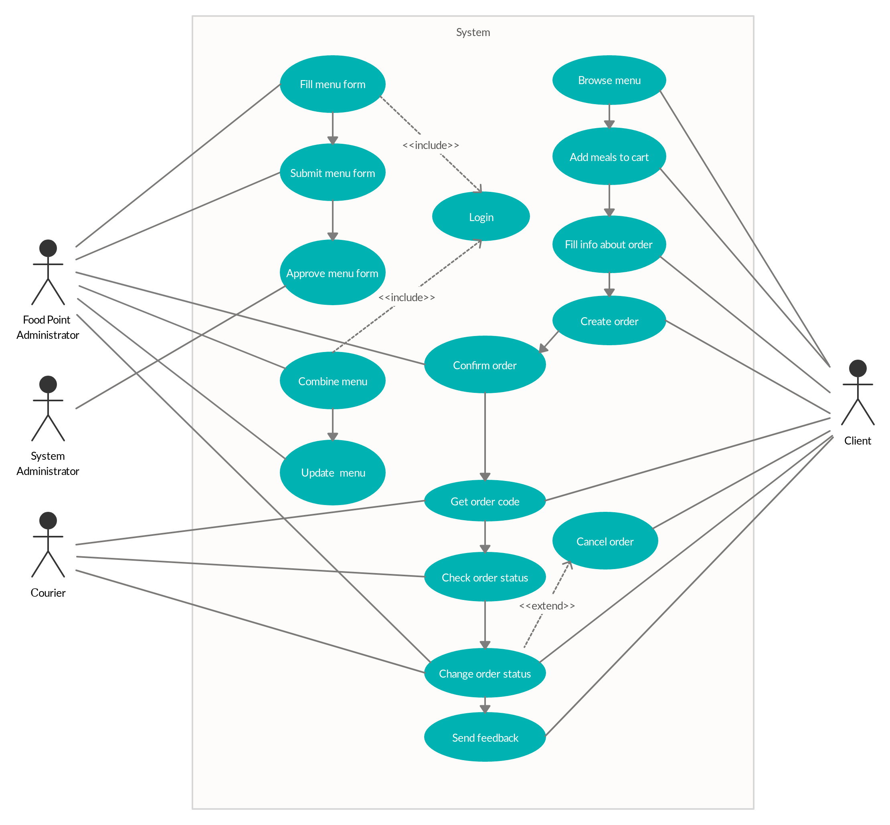

Food Delivery Use Cases
=======================

Order Process
-------------
 
 | **Use Case Name**                | **Order Process**                                                  |
 |:--------------------------------:|:-------------------------------------------------------------------|
 | Actors                           | Client, Administrator                                              |
 | Pre-conditions                   | Meal plans are shown in the system                                 |
 | Flow of events                   | 1\. Client browses menu                                            |
 |                                  | 2\. Client adds meals to delivery cart                             |
 |                                  | 3\. Client adds info about contacts, place and time delivery       |
 |                                  | 4\. Client makes checkout for all items in the cart                |
 |                                  | 5\. New order created and will be shown in the cafe dashboard      |
 | Post-conditions                  | Order will be processed by Administrator                           |
 | Alternative flows and exceptions | The Administrator rejects the order of the client. The client will |
 |                                  | be notified about rejection                                        |
  

Order Cancellation
------------------

  
 | **Use Case Name**                | **Order Cancellation**                                             |
 |:--------------------------------:|:-------------------------------------------------------------------|
 | Actors                           | Client, Administrator                                              |
 | Pre-conditions                   | Order is created by client                                         |
 | Flow of events                   | 1\. Client receives unique identification № of order               |
 |                                  | 2\. Current status of order and cancel-button is displayed on page |
 |                                  | screen                                                             |
 |                                  | 3\. Client cancels order by cancel-button                          |
 |                                  | 4\. Administrator gets notification about cancelling order         |
 | Post-conditions                  | Order is cancelled                                                 |
 | Alternative flows and exceptions | Order can't be cancelled if it already has status "delivering".    |
 

 

Checking order status
---------------------

 
 | **Use Case Name**                | **Checking order status**                                        |
 |:--------------------------------:|:-----------------------------------------------------------------|
 | Actors                           | Client                                                           |
 | Pre-conditions                   | Order is created by client                                       |
 | Flow of events                   | 1\. Client receives unique identification № of order             |
 |                                  | 2\. Client enters № of order to check-order web pages            |
 |                                  | 3\. Current status of the order is displayed on page             |
 | Post-conditions                  | Client gets to know about current order status                   |
 | Alternative flows and exceptions | Unique code of order was not generated -- order can't be checked |
 

Client feedback processing
--------------------------

 
 | **Use Case Name**                | **Client feedback processing**                                             |
 |:--------------------------------:|:---------------------------------------------------------------------------|
 | Actors                           | Client                                                                     |
 | Pre-conditions                   | Order in the "delivered" status, the user on the "Check Order" page        |
 | Flow of events                   | 1\. The system asks the client about the quality of food (like/dislike)    |
 |                                  | 2\. Client makes a choice (like/dislike)                                   |
 |                                  | 3\. Client leaves a comment in the textbox                                 |
 |                                  | 4\. Client submits review-form                                             |
 | Post-conditions                  | Review information appears on "Order Monitor" page of the system next to   |
 | Alternative flows and exceptions | the client's order. User will not provide any review about its quality     |
 
Use Case Diagram
----------------

Glossary
========

1.  **Client** - a person who orders food from the system.

2.  **Administrator** - manages the system and adds new users to the system

