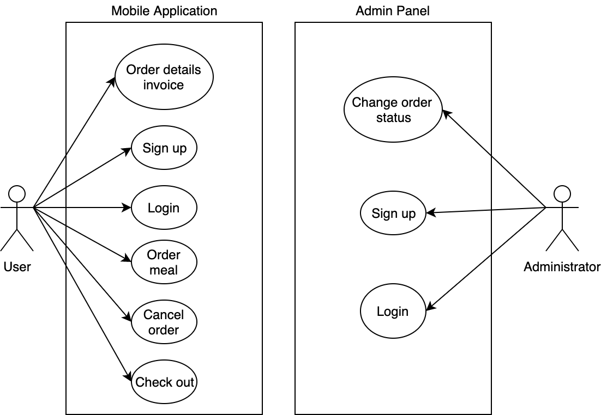

# Food Delivery Use Cases and Use Cases diagram #                                   [go to **Activity Diagram**](./activity-diagram.md)
  * [Order Process](#order-process "Goto Order Process") 
  * [Order Cancellation](#order-cancellation "Goto Order Cancellation")
  * [Checking order status](#checking-order-status "Goto Checking order status")
  * [Login](#login "Goto Login")
  * [Sign up](#sign-up "Goto Sign up")
  * [Check out](#check-out "Goto Check out")
  * [Order Detail invoice](#order-detail-invoice "Goto Order Detail invoice")
  * [Use Case Diagram](#use-case-diagram "Goto Use Case Diagram")
  * [Order Process](#order-process "Goto Order Process") 
  * [Change order status](#order-status "Goto Change order status")
  * [Glossary](#glossary "Goto Glossary")

## Order Process 
Unit tests: [cartAddItemTest](https://github.com/BatyrSeven/innopolis-express/blob/master/MVP/app/src/test/java/mfq/com/refooddelivery2/ParametrizedCartTest.java#L83)

 | **Use Case #1**                  | **Order Process**                                                  |
 |:--------------------------------:|:------------------------------------------------------------------:|
 | Actors                           | Client                                              				           |
 | Pre-conditions                   | Meal plans are shown in the system                                 |
 | Flow of events                   | A1\. Client browses menu                                           |
 |                                  | A2\. Client adds meals to delivery cart                            |
 |                                  | A3\. Client makes checkout for all items in the cart (UC#6)        |
 |                                  | S4\. New order created and will be shown in the cafe dashboard     |
 | Post-conditions                  | Order will be created with status "Pending" and processed by 		    |
 | Alternative flows and exceptions | SE1\. Client can't browse if there is exisitng order with status   |
 |                                  | "pending" or "delivering" - Invoice information will be shown instead|

## Order Cancellation
 | **Use Case #2**                  | **Order Cancellation**                                             |
 |:--------------------------------:|:-------------------------------------------------------------------|
 | Actors                           | Client, Administrator                                              |
 | Pre-conditions                   | Order is created by client                                         |
 | Flow of events                   | S1\. Current status of order and cancel-button is displayed on     |
 |                                  | page screen                                                        |
 |                                  | A2\. Client cancels order by cancel-button                         |
 |                                  | S3\. Administrator gets notification about cancelling order        |
 | Post-conditions                  | Order's status is "Cancelled" 									 |
 | Alternative flows and exceptions | SE1\. Order can't be cancelled if it already has status            |
 | 									| "delivering".  													 |
 

## Checking order status
 | **Use Case #3**                  | **Checking order status**                                       |
 |:--------------------------------:|:----------------------------------------------------------------|
 | Actors                           | Client, Admin                                                   |
 | Pre-conditions                   | Order is created by client                                      |
 | Flow of events                   | S1\. Client/Admin receives unique identification № of order from|
 |									| invoice														  |
 |                                  | A2\. Client/Admin enters № of order to check-order web pages    |
 |                                  | S3\. Current status of the order is displayed on page           |
 | Post-conditions                  | Client gets to know about current order status                  |
 | Alternative flows and exceptions | SE1\. Client/Admin enters id of order which does not exist - gets|
 |                                  | error message from the system									  |

## Login
 | **Use Case #4**                  | **Login**                                                                |
 |:--------------------------------:|:-------------------------------------------------------------------------|
 | Actors                           | Client                                                                   |
 | Pre-conditions                   | None                                                                     |
 | Flow of events                   | S1\. The system requests that the actor enter email and login            |
 |                                  | A2\. Client enters password and login.                                   |
 |                                  | A3\. Client press login button                                           |
 | Alternative flows and exceptions | SE1\. Client leaves one or both of the fields empty or incorrect - gets  |
 |									| message from the system											       |
 |									| SE2\. Client enters incorrect password or nonexistent email - get        |
 |									| message from the system											       |

## Sign up
 | **Use Case #5**                  | **Sign up**                                                              |
 |:--------------------------------:|:-------------------------------------------------------------------------|
 | Actors                           | Client                                                                   |
 | Pre-conditions                   | Client is not loggged in                                                 |
 | Flow of events                   | A1\. Client enters name                                                  |
 |                                  | A2\. Client enters email		                                           |
 |                                  | A3\. Client enters phone number                                          |
 |                                  | A4\. Client enters password.                                             |
 |                                  | A5\. Client retypes the password                                         |
 |                                  | A6\. Client enters address                                               |
 |                                  | A7\. Client Submits data with signup button                              |
 |                                  | S8\. System registers the new client with the given parameters (client   |
 |                                  |  email, password)                                                        |
 | Post-conditions                  | Client's account is created                                              |
 | Alternative flows and exceptions | SE1\. System finds the client name is already in use and displays error  |
 |                                  | message                                                                  |
 |                                  | SE2\. System finds the two passwords are not identical and displays      |
 |                                  | error message                                                            |
 |                                  | SE3\. At least one field is empty or incorrect - display error message   |

## Check out
Unit tests: [productQuantityTest](https://github.com/BatyrSeven/innopolis-express/blob/master/MVP/app/src/test/java/mfq/com/refooddelivery2/ParametrizedCartTest.java#L65), [cartSizeTest](https://github.com/BatyrSeven/innopolis-express/blob/master/MVP/app/src/test/java/mfq/com/refooddelivery2/ParametrizedCartTest.java#L90)

 | **Use Case #6**                  | **Check out**                                                 |
 |:--------------------------------:|:--------------------------------------------------------------|
 | Actors                           | Client                                                        |
 | Precondition                     | 1\. Client's cart is not empty                                |
 | Flow of events                   | S1\. System shows meals that were added to the cart           |
 |                                  | S2\. System shows total price of was added to the cart        |
 |                                  | A3\. Client enters address and phone number                   |
 |                                  | A4\. Client submits and completes check out                   |
 | Postcondition                    | Changed information displays on client screen                 |
 | Alternative flows and exceptions | SE1\. If the cart is empty - display the message 			    |
 |                                  | SE2\. If the client will add the same product several times,  |
 |                                  | the quantity will change only, but not the number of the      | 
 |                                  | elements in the cart                                          |
 |                                  | AE3\. Client deletes meal out of the cart			            |
 |                                  | SE4\. System shows error message if one or both of the fields |
 |                                  | are empty or incorrect 									    |

## Order Detail invoice

 | **Use Case #7**                  | **Order Detail invoice**                             |
 |:--------------------------------:|:-----------------------------------------------------|
 | Actors                           | Client                                               |
 | Precondition                     | 1\. Client has account.                              |
 |                                  | 2\. Client has signed up to the system               |
 |                                  | 3\. Client has ordered meal                          |
 | Flow of enents                   | S1\. System displays unique ID of the order          |
 |                                  | S2\. System display all the information about order: |
 |                                  | meals, price and status                              |
 | Postcondition                    | No post condition.                                   |
 | Alternative flows and exceptions | SE1\. If the status is changed - information on the  |
 |                                  | should be changed                                    |

## Change order status
 | **Use Case #8**                  | **Change order status**                              |
 |:--------------------------------:|:-----------------------------------------------------|
 | Actors                           | Administrator                                        |
 | Precondition                     | 1\. Administrator is signed in to the Admin Panel.   |
 | Flow of enents                   | S1\. Panel shows the list of the orders with information about them |
 |                                  | A2\. Administrator picks the order which status must |
 |                                  | be changed                                           |
 |                                  | A3\. Administrator changes the status of the order   |
 |                                  | S2\. System sends notifies clients by email		   |
 | Postcondition                    | Status of the order is changed 				       |  
 | Alternative flows and exceptions | SE1\. "Delivered" status can't be changed            |

## Use Case Diagram

## Glossary

1.  **Client** - a person who orders food from the system.

2.  **Administrator** - manages the system

3.  **Status** - state of the order. Possible values - Pending, Delivering, Delivered, Cancelled 

