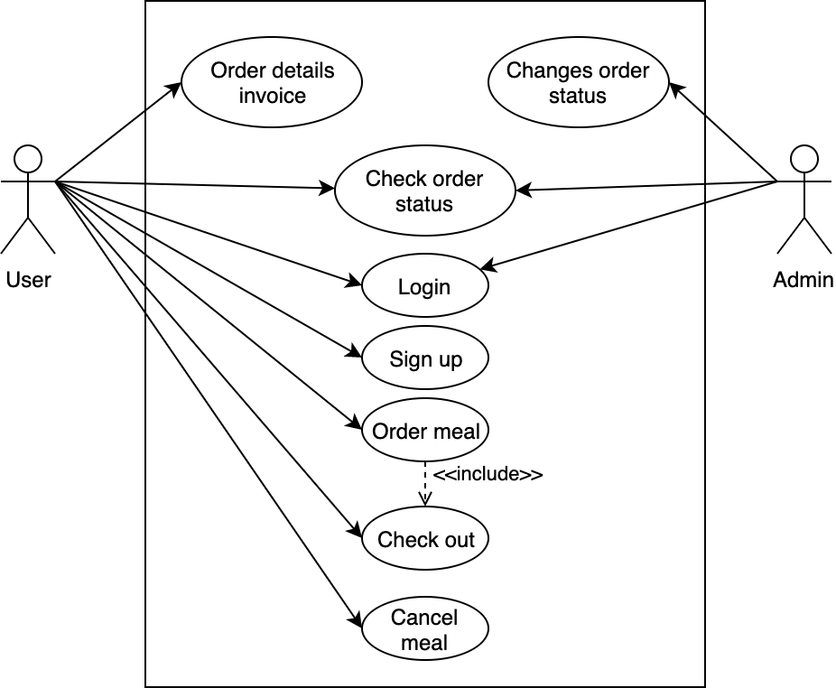

# Food Delivery Use Cases and Use Cases diagram #                                   [go to **Activity Diagram**](./activity-diagram.md)
  * [Order Process](#order-process "Goto Order Process") 
  * [Order Cancellation](#order-cancellation "Goto Order Cancellation")
  * [Checking order status](#checking-order-status "Goto Checking order status")
  * [Login](#login "Goto Login")
  * [Sign up](#sign-up "Goto Sign up")
  * [Check out](#check-out "Goto Check out")
  * [Order Detail invoice](#order-detail-invoice "Goto Order Detail invoice")
  * [Use Case Diagram](#use-case-diagram "Goto Use Case Diagram")
  * [Order Process](#order-process "Goto Order Process") 
  * [Glossary](#glossary "Goto Glossary")

## Order Process 
Unit tests: [cartAddItemTest](https://github.com/BatyrSeven/innopolis-express/blob/master/MVP/app/src/test/java/mfq/com/refooddelivery2/ParametrizedCartTest.java#L83)
 
 | **Use Case #1**                  | **Order Process**                                                  |
 |:--------------------------------:|:-------------------------------------------------------------------|
 | Actors                           | Client, Administrator                                              |
 | Pre-conditions                   | Meal plans are shown in the system                                 |
 | Flow of events                   | 1\. Client browses menu                                            |
 |                                  | 2\. Client adds meals to delivery cart                             |
 |                                  | 3\. Client adds info about contacts, place and time delivery       |
 |                                  | 4\. Client makes checkout for all items in the cart                |
 |                                  | 5\. New order created and will be shown in the cafe dashboard      |
 | Post-conditions                  | Order will be processed by Administrator                           |
 | Alternative flows and exceptions | The Administrator rejects the order of the client. The client will |
 |                                  | be notified about rejection.                                       |
  

## Order Cancellation

  
 | **Use Case #2**                  | **Order Cancellation**                                             |
 |:--------------------------------:|:-------------------------------------------------------------------|
 | Actors                           | Client, Administrator                                              |
 | Pre-conditions                   | Order is created by client                                         |
 | Flow of events                   | 1\. Client receives unique identification № of order               |
 |                                  | 2\. Current status of order and cancel-button is displayed on page |
 |                                  | screen                                                             |
 |                                  | 3\. Client cancels order by cancel-button                          |
 |                                  | 4\. Administrator gets notification about cancelling order         |
 | Post-conditions                  | Order is cancelled                                                 |
 | Alternative flows and exceptions | Order can't be cancelled if it already has status "delivering".    |
 

 

## Checking order status
 
 | **Use Case #3**                  | **Checking order status**                                       |
 |:--------------------------------:|:----------------------------------------------------------------|
 | Actors                           | Client                                                          |
 | Pre-conditions                   | Order is created by client                                      |
 | Flow of events                   | 1\. Client receives unique identification № of order            |
 |                                  | 2\. Client enters № of order to check-order web pages           |
 |                                  | 3\. Current status of the order is displayed on page            |
 | Post-conditions                  | Client gets to know about current order status                  |
 | Alternative flows and exceptions | Unique code of order was not generated.  Order can't be checked |
 |                                  |                                                                 |

## Login

 | **Use Case #4**                  | **Login**                                                                |
 |:--------------------------------:|:-------------------------------------------------------------------------|
 | Actors                           | User                                                                     |
 | Pre-conditions                   | None                                                                     |
 | Flow of events                   | 1\. The system requests that the actor enter email                       |
 |                                  | 2\. User enter password.                                                 |
 |                                  | 3\. User press login button                                              |
 | Alternative flows and exceptions | If User enter an invalid name and/or password, the system display an     |
 |                                  | error message. The user can choose to either return to the  beginning of |
 |                                  | the flow or cancel the login                                             |
 |                                  |                                                                          |
 |                                  |                                                                          |

## Sign up

 | **Use Case #5**                  | **Sign up**                                                              |
 |:--------------------------------:|:-------------------------------------------------------------------------|
 | Actors                           | Client                                                                   |
 | Pre-conditions                   | Client is not loggged in                                                 |
 | Flow of events                   | 1\. Client enters name                                                   |
 |                                  | 2\. Client enters phone number                                           |
 |                                  | 3\. Client enters password.                                              |
 |                                  | 4\. Client retypes the password                                          |
 |                                  | 5\. Client enters address                                                |
 |                                  | 6\. Client Submits data with signup button                               |
 |                                  | 7\. System registers the new user with the give parameters (user name,   |
 |                                  | password)                                                                |
 | Post-conditions                  | User remains signed in                                                   |
 | Alternative flows and exceptions | 1\. System finds the user name is already in use and displays error      |
 |                                  | message                                                                  |
 |                                  | 2\. System finds the two passwords are not identical and displays  error |
 |                                  | message                                                                  |

## Check out
Unit tests: [productQuantityTest](https://github.com/BatyrSeven/innopolis-express/blob/master/MVP/app/src/test/java/mfq/com/refooddelivery2/ParametrizedCartTest.java#L65), [cartSizeTest](https://github.com/BatyrSeven/innopolis-express/blob/master/MVP/app/src/test/java/mfq/com/refooddelivery2/ParametrizedCartTest.java#L90)

 | **Use Case #6**                  | **Check out**                                                 |
 |:--------------------------------:|:--------------------------------------------------------------|
 | Actors                           | Client                                                        |
 | Precondition                     | 1\. Client has account.                                       |
 |                                  | 2\. Client has signed up to the system                        |
 |                                  | 3\. Client has ordered meal                                   |
 | Flow of events                   | 1\. Client checks item or items in the cart                   |
 |                                  | 2\. Client checks total price for current ordered meal/meals  |
 |                                  | 3\. Client checks delivery address or changes address         |
 |                                  | 4\. Client checks number or change number                     |
 |                                  | 5\. Client completes with pressing "update" button            |
 | Postcondition                    | Changes information displays on client screen                 |
 | Alternative flows and exceptions | 1) Client has not created account. System asks to create account |
 |                                  | 2) If the client will add the same product several times, the quantity will change only, but not the number of the elements in the cart |

## Order Detail invoice

 | **Use Case #7**                  | **Order Detail invoice**                             |
 |:--------------------------------:|:-----------------------------------------------------|
 | Actors                           | Client                                               |
 | Precondition                     | 1\. Client has account.                              |
 |                                  | 2\. Client has signed up to the system               |
 |                                  | 3\. Client has ordered meal                          |
 | Flow of enents                   | 1\. Client checks order number                       |
 |                                  | 2\. Client checks meal he or she ordered             |
 |                                  | 3\. Client checks quantity of meal he or she ordered |
 |                                  | 4\. Client checks price                              |
 | Postcondition                    | No post condition.                                   |
 | Alternative flows and exceptions | User cancels order.                                  |
 |                                  |                                                      |

## Change order status

 | **Use Case #8**                  | **Change order status**                              |
 |:--------------------------------:|:-----------------------------------------------------|
 | Actors                           | Administrator                                        |
 | Precondition                     | 1\. Administrator is signed in to the Admin Panel.   |
 | Flow of enents                   | 1\. Administrator sees the list of orders            |
 |                                  | 2\. Administrator picks the order which status must  |
 |                                  | be changed                                           |
 |                                  | 4\. Administrator changes the status of the order    |
 | Postcondition                    | Status of the order is changed and user is notified  | 
 |                                  | by email                                             |

## Use Case Diagram

## Glossary

1.  **Client** - a person who orders food from the system.

2.  **Administrator** - manages the system and adds new users to the system

3.  **Status** - state of the order. Possible values - Pending, Delivering, Delivered

